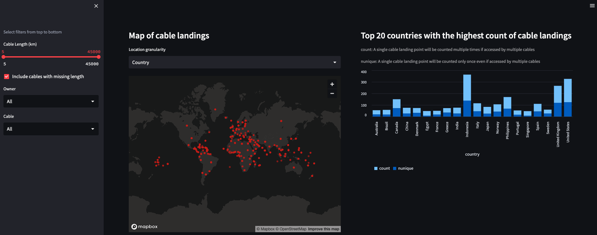

# Visualizing submarine cables landing points

[Link to Final Dashboard](https://fergusonrae-streamlit-data-visualiza-streamlit-dashboard-dzop0f.streamlit.app/)

## Given Prompt
Given the attached JSON file, describe in detail the technical steps you would take to visualize this data in a dashboard or an intelligence report.

Submarine Cables - 2023-02-22.jsons

Provide at least one screenshot of this data visualized by location (does not need to be the entire world, but should show at least five countries in the field of view), and another of this data visualized in a chart showing which countries have the most submarine cable landings.

## Response

### Assumptions
- This is a one time process. No append process needs to be detailed out.
- Dashboard users do not have a specific use case outside of the charts requested.
- No additional data or context can be provided until a POC dashboard is shown.
- When `is_tbd` field is empty/None, that means False.
- Wording of "which countries have the most submarine cable landings" is not specific in whether it is requesting distinct cable landing point locations, or how many cables are connected to the country. Assumed it is the later.

### Technical Steps
1. Scan through the JSON file to view general structure. Load JSON into a table structure to output summary metrics and explore missing data. Detail potential data cleaning given expected output. See [Exploration Notebook](exploration.ipynb).
2. Create a rough data modeling sketch to show relationships between data points. See [Initial Data Modeling Sketch](doc/initial_data_modeling_sketch.png).
3. Perform data cleaning, explore again, clean again, repeat until no known adjustments needed. Data is considered clean when it can be read directly in to the dashboarding code without column value adjustments. See [Cleaning Notebook](cleaning.ipynb).
4. Move cleaning code out of notebook to Python script with unit test cases. TODO: See [Next Steps](#next-steps).
5. Create final data modeling diagram. See [Final Data Modeling Diagram](doc/final_data_modeling_diagram.png).
6. Write dashboard code and deploy. See [streamlit_dashboard.py](streamlit_dashboard.py).

### Screenshot
Screenshot of the application shown below. However, if you would like to interact with this dashboard, please visit its web link [here](https://fergusonrae-streamlit-data-visualiza-streamlit-dashboard-dzop0f.streamlit.app/).

### Next Steps

- Request clarifications and request additional data
    - Clarifications
        - RFS date, does the quarter correspond to calendar year or individual business?
        - Country landing point chart, would you like distinct landing points or total number of cables connected?
    - Additional Data
        - Can two-letter country code be included to minimize poor text mapping?
        - Can lat/long coordinates be added for landing points to increase granularity?
        - Include the order landing points are connected for cable to visualize the general path of the cable? *Nice add-on to visualization if so*
- Move data cleaning to script
    - Allows for writing unit tests.
    - Smaller pieces, easier to make future adjustments and cleanly see steps taken.
    - Deltas are easier to view in Git when not in a notebook.
- If frequent dashboard updates are requested, set up a CI/CD/CT pipeline to automatically test and deploy changes.
- If future appends/writes are needed, create data update pipeline.
- Set up login for dashboard given user emails.
- Allow user to filter by RFS year in the dashboard
